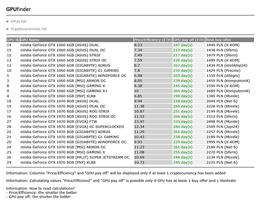

# GPUfinder
> Do you wonder, which GPU will pay off the fastest during cryptocurrency mining? Use GPUfinder to calculate, which GPU is most cost-efficiency choice.
>
> 
>
> **Warning**: This tool desn't collect any data by itself. If you want to proceed proper calculations, you'll have to collect precise data about specific cryptocurrencies, GPUs' efficiencies, power costs and more.
>
> **Warning**: This tool isn't professional advicing solution and its author isn't investment advisor. Author don't take responsibility for shopping or financial decisions made during using this app.

## Table of Contents
* [General Info](#general-information)
* [Technologies Used](#technologies-used)
* [Features](#features)
* [Setup](#setup)
* [Project Status](#project-status)

## General Information
- GPUfinder is a simpel tool, that allows to proceed calculations, which GPU will be most cost-efficiency choice to mine a specific cryptocurrency.
- With this tool you'll able to combine information about GPU's efficiency, power and purchase cost with information about specific cryptocurrency. Received result could help you to make decision which hardware will be the best choice for your project.
- GPUfinder makes super easy calculating the fastest pay off time for many GPUs and cryptocurrencies at the same time.
- This tool was response for my personal needs; I wanted to keep all my calculations in one place and be able to modify them quickly.
- Thanks to GPUfinder I've made decision in 2017 to abandon idea to mine cryptocurrencies, due to current conditions.

## Technologies Used
- PHP 7.4.26
- MySQL 5.7.36
- HTML
- CSS
- JavaScript

## Features
- Calculating Price/Efficiency ratio and pay off time for specific GPU and cryprocurrency.
- Adding/editing/deleting GPUs' details such as: Hashrate, power and purchase cost.
- Adding/editing/deleting cryptocurrencies' details such as name, symbol, price and extraction rate.

## Setup
To run this tool properly you'll need server or hosting with PHP 7.4. and MySQL 5.7.

1. Configure domain or subdomain.
2. Configure system GLOBALS in file /inc/config.php
3. Create empty MySQL database and run SQL commands from file db_structure.sql
4. Enter database details into /inc/dbconnect.php
5. Upload all files from /php_source to your FTP server.

Tool is ready! To start calculations you'll have to add at least one cryptocurrency and GPU.

## Project Status
Project is: _no longer being worked on_. I analized data received from this tool and I've made a decision, to abandon cryptocurrency mining at all.
